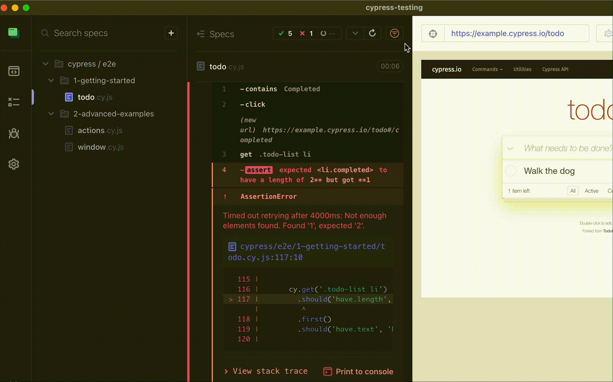

<h2 align=center>Cypress last-failed plugin</h2>
<p align="center">
</p>

<p align="center">
A companion Cypress plugin for `cy-grep` that re-runs the last failed test(s).
</p>



## Overview

Re-run the last failed tests in both `cypress run` and `cypress open` formats for improved development and debugging experience.

This plugin harnesses the powers of `cy-grep` from `@bahmutov/cy-grep` plugin and the Cypress Module API.

## 📦 Installation

1. Install the following packages:

```sh
npm install --save-dev @bahmutov/cy-grep # Dependent package for the plugin
npm install --save-dev cypress-plugin-last-failed
```

2. In `cypress/support/e2e.js` (For E2E tests) and/or `cypress/support/component.js` (For Component tests),

```js
import { failedTestToggle } from 'cypress-plugin-last-failed';

const registerCypressGrep = require('@bahmutov/cy-grep');
registerCypressGrep();

failedTestToggle();
```

3. In `cypress.config`, include the following within `setupNodeEvents` for `e2e` and/or `component` testing:

```js
const { defineConfig } = require('cypress');
const { collectFailingTests } = require('cypress-plugin-last-failed');

module.exports = defineConfig({
  e2e: {
    setupNodeEvents(on, config) {
      collectFailingTests(on, config);

      require('@bahmutov/cy-grep/src/plugin')(config);
      return config;
      // implement node event listeners here
    },
  },
});
```

## 🦺 Setup

1. To enable the plugin to collect and record the most recent run's failing tests, set the environment variable `collectFailingTests` to `true`.

2. **Suggestion**: Set two common environment variables tied to the `@bahmutov/cy-grep` package within a config to enhance the experience utilizing the grep logic within the Cypress Test Runner UI using `cypress open`:

```json
{
  "env": {
    "grepOmitFiltered": true,
    "grepFilterSpecs": true
  }
}
```

More information on `grepOmitFiltered` and `grepFilterSpecs` can be read within the [README for `@bahmutov/cy-grep`](https://github.com/bahmutov/cy-grep?tab=readme-ov-file#pre-filter-specs-grepfilterspecs)

For suggestions on how to set these environment variable(s) for use in your project, see [Example Environment Variable Setups](#-example-environment-variable-setups).

3. If you do not want to commit the file storing last failed tests to your remote repository, include a rule within your project's `.gitignore` file:

```
# Last failed storage directory
**/cypress/fixtures/last-failed
```

## Usage with `cypress run`

Once you have run tests using `cypress run` and the run concluded with at least 1 failed test, you can run the following command to re-run the failed test(s) from the terminal:

```cli
npx cypress-run-last-failed run
```

You can also include more cli arguments as desired, as the `npx` command is pointing to a node script harnessing the power of [Cypress module API](https://docs.cypress.io/guides/guides/module-api):

```cli
npx cypress-run-last-failed run --e2e --browser chrome
```

## 📃 `npm` script option

For convenience, you may desire to house the `npx` command within an npm script in your project's `package.json`, including any desired cli arguments:

```json
  "scripts": {
    "run-last-failed": "npx cypress-run-last-failed run --e2e --browser electron"
  }
```

## Filter failed tests within `cypress open`

Within the Cypress Test Runner UI using `cypress open`, this plugin provides a filter within each spec file positioned on the reporter.

Toggling the filter will run any previously failed tests on the particular spec file.

## 📕 Example Environment Variable Setups

The following options are suggestions of how to set the environment variable. A more comprehensive [guide on environment variable setting](https://docs.cypress.io/guides/guides/environment-variables#Setting) can be found within official Cypress documentation.

### Setup using `cypress.env.json`

Add environment variable(s) to a created `cypress.env.json` file.

Example:

```js
{
  "collectFailingTests": true,
  "grepOmitFiltered": true,
  "grepFilterSpecs": true
}
```

This is a useful method for handling local use of this plugin, particularly if you add `cypress.env.json` to your `.gitignore` file. This way, enabling the plugin functionality via environment variable can be different for each developer machine rather than committed to the remote repository.

From official Cypress docs, more information on the [`cypress.env.json` method](https://docs.cypress.io/guides/guides/environment-variables#Option-2-cypressenvjson).

### Setup using `--env`

Alternatively, append the environment variable to the end of your `cypress open` cli command:

```shell
npx cypress open --env collectFailingTests=true,grepOmitFiltered=true,grepFilterSpecs=true
```

## Contributions

Feel free to open a pull request or drop any feature request or bug in the [issues](https://github.com/dennisbergevin/cypress-plugin-last-failed/issues).

Please see more details in the [contributing doc](./CONTRIBUTING.md).
