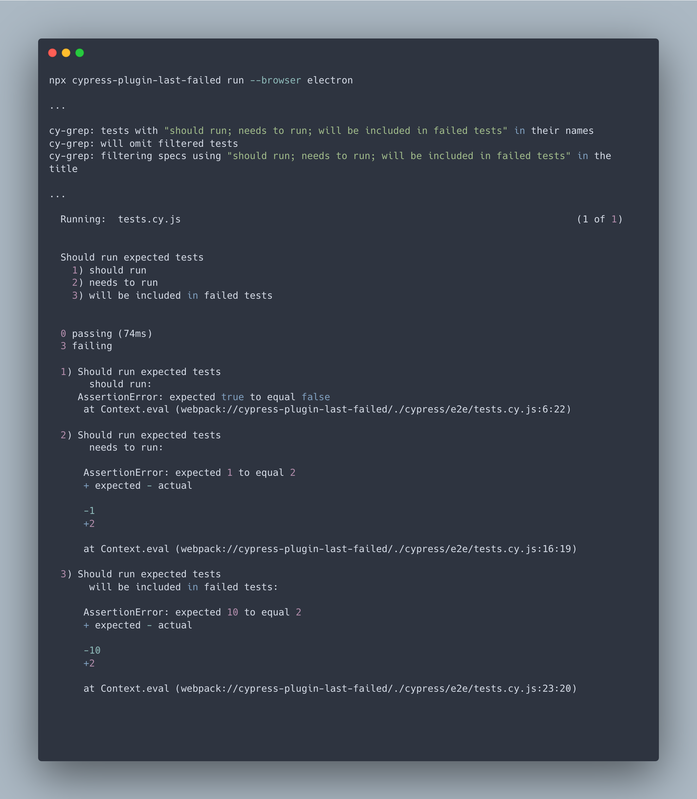

<h2 align=center>Cypress last-failed plugin</h2>
<p align="center">
</p>

<p align="center">
A companion Cypress plugin for <code>cy-grep</code> that re-runs the last failed test(s).
</p>




## Features

- 👟 A new `cypress run` command to **only** run the previous run's failed tests
- ⏳ A new UI toggle within `cypress open` to filter and only run any failed tests in a given spec
- 🤖 CI/CD support

#### Table of Contents

- [Installation](#-installation)
- [Run mode](#-run-mode)
  - [Optional custom `failedTestDirectory`](#optional-custom-failedtestdirectory)
  - [Add rule to gitignore](#add-rule-to-gitignore)
  - [Setting up a `npm` script](#-setting-up-a-npm-script)
- [Open mode](#-open-mode)
  - [Recommended open mode env variables](#recommended-open-mode-env-variables)
- [CI support](#continuous-integration-support)
- [Typescript support](#typescript-support)
- [Contributions](#contributions)

---

## 📦 Installation

1. Install the following packages:

```sh
npm install --save-dev @bahmutov/cy-grep # Dependent package for the plugin
npm install --save-dev cypress-plugin-last-failed
```

2. In `cypress/support/e2e.js` (For E2E tests) and/or `cypress/support/component.js` (For Component tests),

```js
import { failedTestToggle } from 'cypress-plugin-last-failed';

const registerCypressGrep = require('@bahmutov/cy-grep');
registerCypressGrep();

failedTestToggle();
```

3. In `cypress.config`, include the following within `setupNodeEvents` for `e2e` and/or `component` testing:

```js
module.exports = defineConfig({
  screenshotOnRunFailure: false,
  env: {
    failedTestDirectory: './',
    grepOmitFiltered: true,
    grepFilterSpecs: true,
  },
  e2e: {
    setupNodeEvents(on, config) {
      collectFailingTests(on, config);

      require('@bahmutov/cy-grep/src/plugin')(config);
      return config;
    },
  },
  component: {
    setupNodeEvents(on, config) {
      collectFailingTests(on, config);

      require('@bahmutov/cy-grep/src/plugin')(config);
      return config;
    },
  },
});
```

---

## 👟 Run mode

1. Run tests using `cypress run`:

```bash
# Example
npx cypress run
```

2. If there are failed tests, run the following command from the **directory of the project's `cypress.config`**:

```bash
npx cypress-last-failed run
```

You can also include more cli arguments similar to `cypress run`, as the command harnesses the power of [Cypress module API](https://docs.cypress.io/guides/guides/module-api):

```bash
# Example
npx cypress-last-failed run --e2e --browser chrome
```

### Optional custom `failedTestDirectory`

By default, there will be a folder called `test-results` created in the directory of the `cypress.config`.

- To customize where the `test-results` folder should be stored, add the `failedTestDirectory` environment variable:

```js
// Example using a fixtures folder path relative to the cypress.config

module.exports = defineConfig({
  env: {
    failedTestDirectory: './cypress/fixtures',
  },
  e2e: {
    setupNodeEvents(on, config) {},
  },
});
```

### Add rule to gitignore

- **Optional**: If you do not want to commit the file storing last failed tests to your remote repository, include a rule within your project's `.gitignore` file:

```

# Example

**/test-results

```

### 📃 Setting up a `npm` script

For convenience, you may desire to house the `npx` command within an npm script in your project's `package.json`, including any desired cli arguments:

```json
  "scripts": {
    "last-failed": "npx cypress-run-last-failed run --e2e --browser electron"
  }
```

## ⌛ Open mode

Toggling the filter will run any previously failed tests on the particular spec file.


### Recommended open mode env variables

- **Recommended**: Set two common environment variables tied to the `@bahmutov/cy-grep` package to enhance the experience utilizing the grep logic within the Cypress Test Runner UI using `cypress open`:

```json
{
  "env": {
    "grepOmitFiltered": true,
    "grepFilterSpecs": true
  }
}
```

> [!NOTE]
> More information on `grepOmitFiltered` and `grepFilterSpecs` can be read within the [README for `@bahmutov/cy-grep`](https://github.com/bahmutov/cy-grep?tab=readme-ov-file#pre-filter-specs-grepfilterspecs).

---

## Continuous integration support

An example of utilizing the plugin to re-run only the failed tests from a previous step in CI:

```yaml
name: test-last-failed-node-script
on:
  push:
    branches:
      - 'main'
  pull_request:
  workflow_dispatch:

jobs:
  node-script:
    runs-on: ubuntu-22.04
    steps:
      - name: Checkout 📦
        uses: actions/checkout@v4
      - name: Cypress run 👟
        uses: cypress-io/github-action@v6
      - name: Output the file contents 📝
        if: always()
        run: |
          cat ./test-results/last-run.txt
      - name: Custom tests 🧪
        if: always()
        uses: cypress-io/github-action@v6
        with:
          command: npx cypress-last-failed run
          working-directory: ${{ github.workspace }}
```

## Typescript support

For more information on Typescript support involved with `@bahmutov/cy-grep` package, refer to it's [README](https://github.com/bahmutov/cy-grep?tab=readme-ov-file#typescript-support).

## Contributions

Feel free to open a pull request or drop any feature request or bug in the [issues](https://github.com/dennisbergevin/cypress-plugin-last-failed/issues).

Please see more details in the [contributing doc](./CONTRIBUTING.md).
